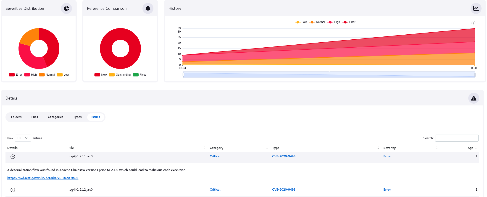
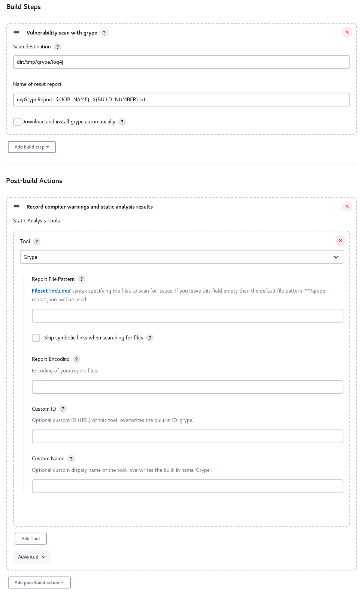
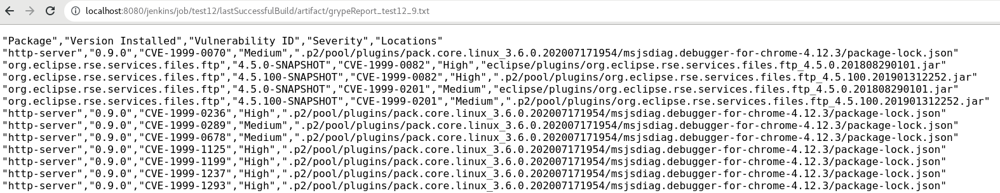
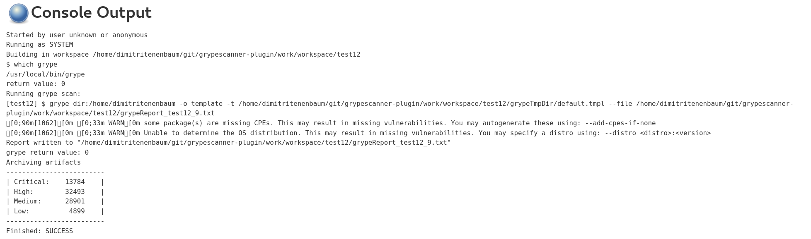

# Grype vulnerability scanner

## Introduction

[Grype](https://github.com/anchore/grype) is a vulnerability scanner for container images and filesystems.
This jenkins plugin scans a given target and saves a report as job artifact.
Starting from version 1.7, the grype plugin can be integrated with the [Warnings Next Generation plugin](https://plugins.jenkins.io/warnings-ng/) (minimal version: 10.3.0).



## Getting started
This jenkins plugin installs grype in the job workspace directory and performs scan.
See section [Installation/Recommended](https://github.com/anchore/grype) for more installation details.

#### Grype as a build step:


#### Possible scan targets:


#### Configure [Warnings Next Generation plugin](https://plugins.jenkins.io/warnings-ng/):


#### Scan result report as job artifact:


#### Scan results:




### Usage in a pipeline:
```groovy
pipeline
{
  agent any
  options
  {
    skipStagesAfterUnstable()
  }
  stages
  {
    stage('Build')
    {
      steps
      {
        grypeScan scanDest: 'dir:/tmp', repName: 'myScanResult.txt', autoInstall:true
      }
    }
  }
}
```


#### Acknowledgments
Thanks to Patrick Röder and Thomas Spicker for contributions and creative input!


## LICENSE

Licensed under MIT, see [LICENSE](LICENSE.md)

